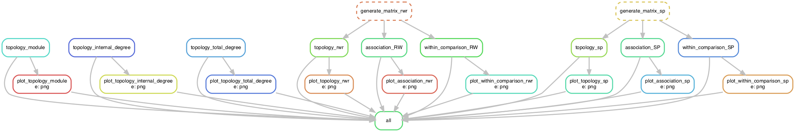

# PyGNA Snakemake workflow:

Current version:  0.1.1-dev

A simple Snakemake workflow to perform network analyses using the Python Geneset Network Analysis ([PyGNA](https://github.com/stracquadaniolab/pygna)) package.

## Authors

* Viola Fanfani, v.fanfani@sms.ed.ac.uk (lead developer)
* Giovanni Stracquadanio, giovanni.stracquadanio@ed.ac.uk

## Overview

## Usage

#### Step 1: Install workflow

If you simply want to use this workflow, download and extract the [latest release](https://github.com/stracquadaniolab/workflow-pygna/releases).

In any case, if you use this workflow in a paper, please cite our PyGNA as follows:

#### Step 2: Configure workflow

Configure the workflow according to your needs, via editing the file `config.yaml`.

#### Step 3: Execute workflow

Test your configuration by performing a dry-run via

    snakemake --use-conda -n

Execute the workflow locally via

    snakemake --use-conda --cores $N

using `$N` cores or run it in a cluster environment via

    snakemake --use-conda --cluster qsub --jobs 100

or

    snakemake --use-conda --drmaa --jobs 100

If you not only want to fix the software stack but also the underlying OS, use

    snakemake --use-conda --use-singularity

in combination with any of the modes above.
See the [Snakemake documentation](https://snakemake.readthedocs.io/en/stable/executable.html) for further details.

#### Step 4: Check results

Results are stored in the `results` folder. 
